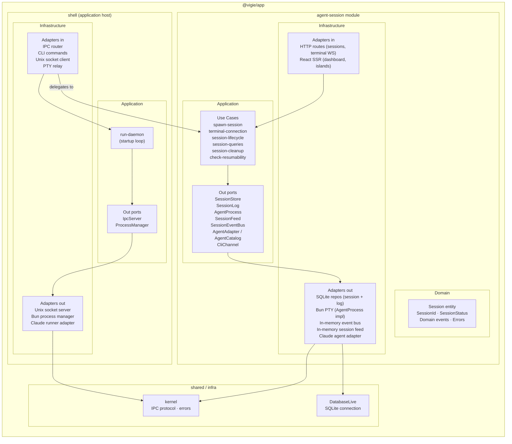
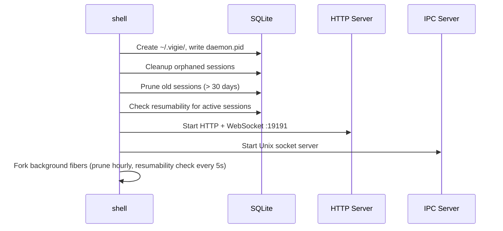
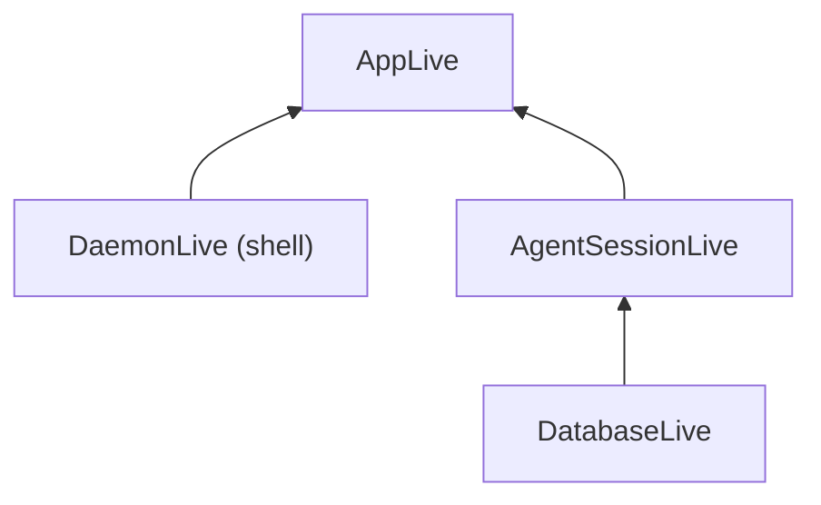

# Module architecture

vigie follows hexagonal architecture (ports & adapters) with one bounded domain module (`agent-session`) and an application shell (`shell`).

## Module map

## agent-session module

**Bounded context:** session lifecycle, agent process management, session output streaming.

### Domain

| Symbol | Role |
|---|---|
| `Session` | Aggregate root — state machine: `active → ended / error` |
| `SessionId` | Branded string type |
| `SessionStatus` | `active \| ended \| error` |
| Domain events | `session:started` · `session:ended` · `session:agent-id-detected` · `terminal:output` · `terminal:pty-resized` |

### Application — use cases

| Use case | Responsibility |
|---|---|
| `spawn-session` | Create session record, spawn PTY, wire output → storage + events |
| `session-lifecycle` | Transition session status (active, ended, error) |
| `session-queries` | Fetch sessions, terminal chunks, input history |
| `session-cleanup` | Delete session + associated data |
| `check-resumability` | Query FS to determine if a session can be resumed |

### Application — out ports

| Port | Shape | Implemented by |
|---|---|---|
| `session-store.port.ts` | `SessionStoreShape` | `SqliteSessionRepository` |
| `session-log.port.ts` | `SessionLogShape` | `SqliteTerminalRepository` |
| `agent-process.port.ts` | `AgentProcessShape` | `createPtyManager` (Bun PTY) |
| `session-feed.port.ts` | `SessionFeedShape` | In-memory pub/sub (`terminal-subscribers.ts`) |
| `session-event-bus.port.ts` | `SessionEventBusShape` | In-memory pub/sub (`session-event-bus.adapter.ts`) |
| `agent-adapter.port.ts` | `AgentAdapter` / `AgentCatalogShape` | `claudeAdapter` + `createAgentCatalog` |
| `cli-channel.port.ts` | `CliChannelShape` | `CliChannelLive` (writes back to IPC socket) |

### Infrastructure — adapters in

| Adapter | Exposes |
|---|---|
| `session.routes.tsx` | `POST /sessions/create` · `/kill` · `/resume` · `GET /api/sessions` |
| `terminal.routes.ts` | `GET /api/sessions/:id/chunks` · `WS /ws/terminal/:sessionId` |
| `dashboard.view.tsx` | React SSR — `GET /` |
| `SpawnSessionForm.island.tsx` | Client-side Vite island |

---

## shell

**Role:** Application host — not a domain module. No bounded context, no domain model.

Owns process lifecycle, HTTP/IPC server wiring, and CLI commands. Delegates all business logic to `agent-session`.

### Startup sequence (`run-daemon`)

### Infrastructure — adapters in

| Adapter | Role |
|---|---|
| `ipc-router.ts` | Route IPC messages to agent-session use cases |
| `claude.command` | Register + spawn Claude agent, relay PTY to stdout |
| `daemon.command` | `start / stop / restart / status / logs / attach` |
| `session-*.command` | `list / attach / resume` |
| `open.command` | Open browser dashboard |

---

## Dependency wiring

`AppLive` is the root composition in `src/dependencies.ts` — the single wiring point for `agent-session` + shell infrastructure.

## See also

- [System overview](./overview.md) — high-level components and communication protocols
