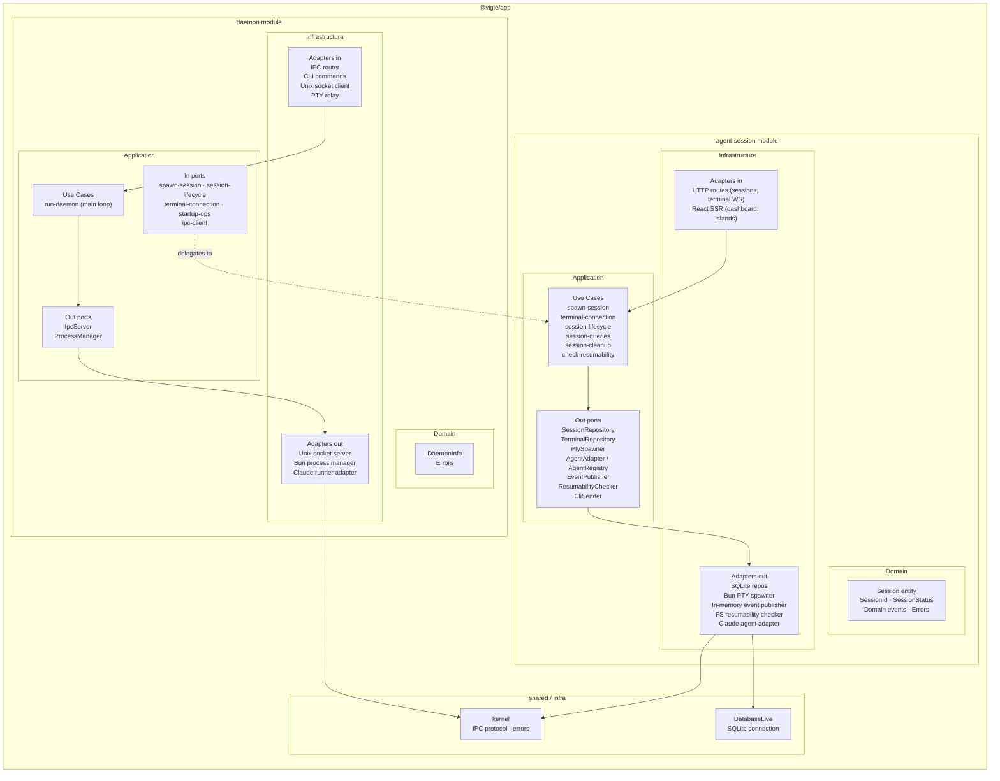
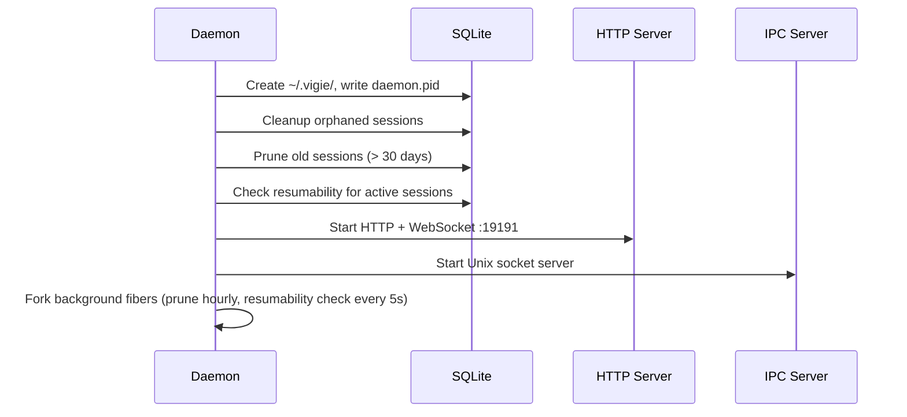
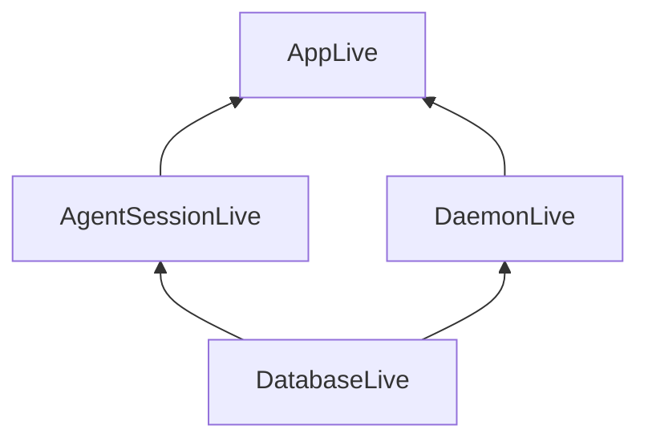

# Module architecture

vigie follows hexagonal architecture (ports & adapters) with two bounded modules.

## Module map

## agent-session module

**Bounded context:** session lifecycle, PTY I/O, terminal streaming.

### Domain

| Symbol | Role |
|---|---|
| `Session` | Aggregate root — state machine: `active → ended / error` |
| `SessionId` | Branded string type |
| `SessionStatus` | `active \| ended \| error` |
| Domain events | `session:started` · `session:ended` · `session:agent-id-detected` · `terminal:output` · `terminal:pty-resized` |

### Application — use cases

| Use case | Responsibility |
|---|---|
| `spawn-session` | Create session record, spawn PTY, wire output → storage + events |
| `terminal-connection` | Route stdin/resize between CLI/browser channels and PTY |
| `session-lifecycle` | Transition session status (active, ended, error) |
| `session-queries` | Fetch sessions, terminal chunks, input history |
| `session-cleanup` | Delete session + associated data |
| `check-resumability` | Query FS to determine if a session can be resumed |

### Application — out ports

| Port | Implemented by |
|---|---|
| `SessionRepository` | `SqliteSessionRepository` |
| `TerminalRepository` | `SqliteTerminalRepository` |
| `PtySpawner` | `BunPtySpawner` |
| `AgentAdapter` + `AgentRegistry` | `ClaudeAdapter` + `AgentRegistry` |
| `EventPublisher` | In-memory pub/sub |
| `ResumabilityChecker` | `FsResumabilityChecker` |
| `CliSender` | `CliSenderLive` (writes back to IPC socket) |

### Infrastructure — adapters in

| Adapter | Exposes |
|---|---|
| `session.routes.tsx` | `POST /sessions/create` · `/kill` · `/resume` · `GET /api/sessions` |
| `terminal.routes.ts` | `GET /api/sessions/:id/chunks` · `WS /ws/terminal/:sessionId` |
| `dashboard.view.tsx` | React SSR — `GET /` |
| `SpawnSessionForm.island.tsx` | Client-side Vite island |

---

## daemon module

**Bounded context:** daemon lifecycle, IPC server, CLI command dispatch.

### Application — use cases

| Use case | Responsibility |
|---|---|
| `run-daemon` | Startup sequence, HTTP+WS server, IPC server, periodic maintenance |

### Startup sequence (`run-daemon`)

### Infrastructure — adapters in

| Adapter | Role |
|---|---|
| `ipc-router.ts` | Route IPC messages to agent-session use cases |
| `claude.command` | Register + spawn Claude agent, relay PTY to stdout |
| `daemon.command` | `start / stop / restart / status / logs / attach` |
| `session-*.command` | `list / attach / resume` |
| `open.command` | Open browser dashboard |

---

## Dependency wiring

`AppLive` is the root composition provided to the daemon entry point.

## See also

- [System overview](./overview.md) — high-level components and communication protocols
