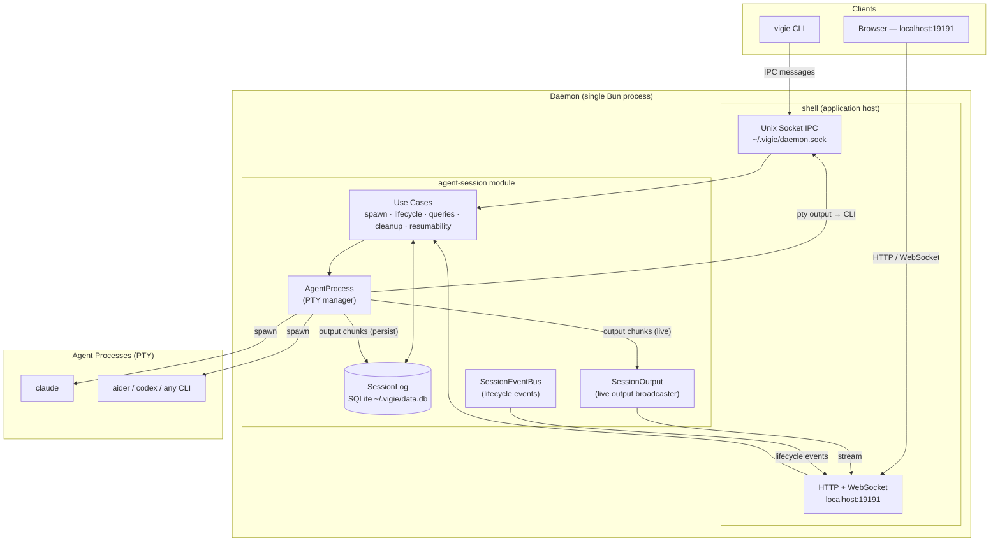

# Architecture overview

Fully local — single Bun process, no remote servers, no cloud dependency.

## Communication protocols

| Channel | Protocol | Path |
|---|---|---|
| CLI → Daemon | Unix socket (JSON messages) | `~/.vigie/daemon.sock` |
| Browser → Daemon | HTTP REST + WebSocket | `localhost:19191` |
| Daemon → Agent | PTY (pseudo-terminal) | spawned subprocess |
| Daemon → CLI | Unix socket (binary + JSON) | same socket, reverse |

## IPC message types

CLI → Daemon: `session:register` · `session:spawn-interactive` · `session:stdin` · `session:cli-resize` · `session:attach` · `session:detach` · `session:resume` · `session:done` · `session:deregister` · `session:agent-id` · `session:output` · `session:terminal-output`

Daemon → CLI: `session:registered` · `session:spawned` · `session:spawn-failed` · `session:pty-output` · `session:pty-exited` · `session:pty-resized` · `session:replay-complete` · `session:terminal-input` · `session:terminal-resize` · `session:error-response`

## Storage

Single SQLite database at `~/.vigie/data.db`:

| Table | Content |
|---|---|
| `sessions` | Session metadata, status, agent session ID |
| `terminal_chunks` | PTY output chunks (binary) |
| `input_history` | Stdin history per session |
| `event_queue` | Domain event log |

## See also

- [Module architecture](./modules.md) — hexagonal architecture, ports & adapters per module
